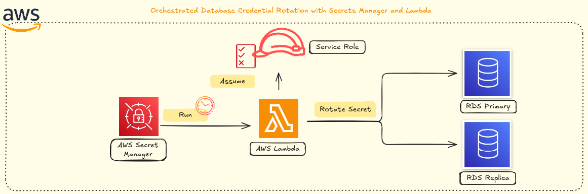

<div align="center">
  


## AWS RDS Credentials Rotation with Secrets Manager + Lambda – Zero-Downtime Automation

**Updated: January 2, 2026**

[](https://github.com/nicoleepaixao)
[](https://github.com/nicoleepaixao/aws-secrets-rotation)

</div>

---

<p align="center">
  
</p>

## **Overview**

This project implements automated credential rotation for Amazon RDS databases using AWS Secrets Manager and Lambda. The solution eliminates credential drift, removes manual password management, and ensures zero-downtime rotations through a fail-safe versioning system. Applications never experience interruptions as they always consume the current valid credential.

---

## **The Problem**

In environments with multiple services, pipelines, teams, and integrations, credentials management typically accumulates the following issues:

| **Common Practice** | **Risk** |
|-------------------|---------|
| **Environment Variables** | Passwords stored in plaintext configuration |
| **Pipeline Secrets** | Credentials copied across CI/CD tools |
| **Chat Messages** | Passwords shared in internal communications |
| **Shared Access** | Same credentials used across multiple teams |
| **Manual Rotation** | Sporadic, error-prone password changes |
| **No Validation** | Password changes without connectivity testing |

### **Real-World Scenario: Credential Drift**

```text
Someone manually changes RDS password
    ↓
Password updated in database
    ↓
Application attempts authentication with old password
    ↓
All connections fail
    ↓
Production environment goes down
```

This is called **credential drift** - when the secret and the database become out of sync.

### **Why This Matters**

| **Risk** | **Impact** |
|---------|-----------|
| **Human Exposure** | Passwords seen and shared by multiple people |
| **Static Credentials** | Same password used for years |
| **Internal Leaks** | Credentials exposed in tickets, logs, repos |
| **Limited Auditing** | No visibility into who accessed what |
| **Production Outages** | Manual changes break active connections |

---

## **Solution: Automated Rotation**

AWS Secrets Manager's rotation model prevents:

| **Problem** | **Solution** |
|------------|-------------|
| **Credential Drift** | Secret and database always synchronized |
| **Manual Dependencies** | Fully automated rotation cycle |
| **Insecure Changes** | Validated before promotion |
| **Service Interruption** | Zero-downtime version management |
| **Human Access** | Applications consume secrets programmatically |

---

## **Architecture**

### **Core Principle**

The solution maintains:

- ✅ **Single Secret** per database user
- ✅ **Version-based rotation** with staging labels
- ✅ **Validation before promotion** ensuring connectivity
- ✅ **Automatic rollback** on failure

### **Version Stages**

| **Stage** | **Purpose** | **Used By** |
|-----------|------------|------------|
| `AWSCURRENT` | Active password | Application reads this |
| `AWSPENDING` | New password being tested | Rotation Lambda validates this |

### **Rotation Flow**

<div align="center">

```text
┌─────────────────────────────────────────────────────────────────┐
│                   AWS Secrets Manager                            │
│                                                                  │
│  ┌────────────────────────────────────────────────────────┐    │
│  │  Secret: prod/rds/admin                                 │    │
│  │  ├── AWSCURRENT (active password)                       │    │
│  │  └── AWSPENDING (new password, being validated)         │    │
│  └─────────────────┬──────────────────────────────────────┘    │
└────────────────────┼───────────────────────────────────────────┘
                     │
                     │ Triggers rotation
                     ▼
┌─────────────────────────────────────────────────────────────────┐
│              Lambda Rotation Function                            │
│  ┌────────────────────────────────────────────────────────┐    │
│  │  Step 1: createSecret  → Generate new password          │    │
│  │  Step 2: setSecret     → ALTER USER in RDS             │    │
│  │  Step 3: testSecret    → Validate connectivity         │    │
│  │  Step 4: finishSecret  → Promote AWSPENDING            │    │
│  └─────────────────┬──────────────────────────────────────┘    │
└────────────────────┼───────────────────────────────────────────┘
                     │
                     │ Executes ALTER USER
                     ▼
┌─────────────────────────────────────────────────────────────────┐
│                   Amazon RDS / Aurora                            │
│  ┌────────────────────────────────────────────────────────┐    │
│  │  Database: production                                   │    │
│  │  User: adminuser                                        │    │
│  │  Password: (managed automatically)                      │    │
│  └────────────────────────────────────────────────────────┘    │
└─────────────────────────────────────────────────────────────────┘
                     ▲
                     │
                     │ Application reads AWSCURRENT
                     │
┌─────────────────────────────────────────────────────────────────┐
│                      Application                                 │
│  ┌────────────────────────────────────────────────────────┐    │
│  │  ❌ No hardcoded passwords                             │    │
│  │  ❌ No environment variables with credentials          │    │
│  │  ❌ No manual password management                       │    │
│  │  ✅ GetSecretValue(AWSCURRENT) on every connection     │    │
│  └────────────────────────────────────────────────────────┘    │
└─────────────────────────────────────────────────────────────────┘
```

</div>

### **How Applications Consume Secrets**

```python
# Application code (Python example)
import boto3
import json

def get_database_connection():
    client = boto3.client('secretsmanager')
    
    # Always fetch AWSCURRENT
    response = client.get_secret_value(SecretId='prod/rds/admin')
    secret = json.loads(response['SecretString'])
    
    # Connect to database with current password
    conn = psycopg2.connect(
        host=secret['host'],
        port=secret['port'],
        user=secret['username'],
        password=secret['password'],
        dbname=secret['dbname']
    )
    return conn
```

**Application never knows when rotation occurs** - it simply reads the current valid credential.

---

## **How It Works**

### **Secret Structure**

The secret contains all connection information:

```json
{
  "engine": "postgres",
  "host": "your-rds-endpoint.rds.amazonaws.com",
  "port": 5432,
  "username": "adminuser",
  "password": "automatically-managed",
  "dbname": "postgres"
}
```

**Key Point:** One Secret = One User = One Database

This design prevents:

- ❌ Accidental rotation of wrong database
- ❌ Cross-environment credential changes
- ❌ Production impact from test rotations

### **Rotation Steps (AWS Official Flow)**

| **Step** | **Action** | **Result** |
|----------|-----------|-----------|
| **1. createSecret** | Generate new password and create AWSPENDING version | New credential ready for testing |
| **2. setSecret** | Execute `ALTER USER` statement in RDS | Database password updated |
| **3. testSecret** | Attempt connection with new password | Validation ensures connectivity |
| **4. finishSecret** | Promote AWSPENDING → AWSCURRENT | Application starts using new password |

### **Fail-Safe Behavior**

If any step fails:

```text
❌ Step 2 fails (ALTER USER error)
    ↓
❌ Promotion does not occur
    ↓
✅ AWSCURRENT remains unchanged
    ↓
✅ Application continues with old password
    ↓
✅ System remains stable
```

**No downtime under any failure scenario.**

---

## **Lambda Rotation Function**

### **Complete Code (PostgreSQL/Aurora)**

```python
import boto3
import json
import logging
import random
import string
import psycopg2

logger = logging.getLogger()
logger.setLevel(logging.INFO)

secrets_client = boto3.client("secretsmanager")

def generate_password(length=32):
    """Generate cryptographically secure password"""
    chars = string.ascii_letters + string.digits + "!@#$%^&*()-_=+"
    return "".join(random.choice(chars) for _ in range(length))

def get_secret_dict(secret_id, stage=None, version_id=None):
    """Retrieve secret value with specific version or stage"""
    params = {"SecretId": secret_id}
    if version_id:
        params["VersionId"] = version_id
    elif stage:
        params["VersionStage"] = stage

    resp = secrets_client.get_secret_value(**params)

    if "SecretString" not in resp:
        raise ValueError("Binary secrets not supported.")

    return json.loads(resp["SecretString"])

def get_db_connection(secret_dict):
    """Create database connection using secret credentials"""
    return psycopg2.connect(
        host=secret_dict["host"],
        port=secret_dict.get("port", 5432),
        user=secret_dict["username"],
        password=secret_dict["password"],
        dbname=secret_dict.get("dbname", "postgres"),
        connect_timeout=5,
    )

def lambda_handler(event, context):
    """Main rotation handler called by Secrets Manager"""
    
    step = event["Step"]
    secret_id = event["SecretId"]
    token = event["ClientRequestToken"]

    # Validate rotation is enabled
    metadata = secrets_client.describe_secret(SecretId=secret_id)

    if not metadata.get("RotationEnabled"):
        raise ValueError("Rotation is not enabled for this secret.")

    versions = metadata["VersionIdsToStages"]

    if token not in versions:
        raise ValueError("ClientRequestToken not found in versions.")

    if "AWSPENDING" not in versions[token]:
        raise ValueError("Version is not in AWSPENDING stage.")

    # Execute appropriate step
    if step == "createSecret":
        create_secret(secret_id, token)
    elif step == "setSecret":
        set_secret(secret_id, token)
    elif step == "testSecret":
        test_secret(secret_id, token)
    elif step == "finishSecret":
        finish_secret(secret_id, token)
    else:
        raise ValueError(f"Invalid step: {step}")

def create_secret(secret_id, token):
    """Step 1: Generate new password and create AWSPENDING version"""
    
    # Check if AWSPENDING already exists
    try:
        secrets_client.get_secret_value(
            SecretId=secret_id,
            VersionId=token,
            VersionStage="AWSPENDING"
        )
        logger.info("AWSPENDING version already exists")
        return
    except secrets_client.exceptions.ResourceNotFoundException:
        pass

    # Get current version
    current = get_secret_dict(secret_id, stage="AWSCURRENT")

    if "password" not in current:
        raise ValueError(
            "Initial password must exist in AWSCURRENT before first rotation."
        )

    # Create new version with new password
    pending = current.copy()
    pending["password"] = generate_password()

    secrets_client.put_secret_value(
        SecretId=secret_id,
        ClientRequestToken=token,
        SecretString=json.dumps(pending),
        VersionStages=["AWSPENDING"]
    )
    
    logger.info("Created AWSPENDING version with new password")

def set_secret(secret_id, token):
    """Step 2: Update database password using AWSCURRENT credentials"""
    
    pending = get_secret_dict(secret_id, version_id=token)
    current = get_secret_dict(secret_id, stage="AWSCURRENT")

    # Connect with current credentials
    conn = get_db_connection(current)
    conn.autocommit = True

    try:
        with conn.cursor() as cur:
            # Execute ALTER USER with new password
            cur.execute(
                f"ALTER USER {pending['username']} WITH PASSWORD %s",
                (pending["password"],),
            )
        logger.info(f"Password updated in database for user {pending['username']}")
    finally:
        conn.close()

def test_secret(secret_id, token):
    """Step 3: Validate new password by attempting connection"""
    
    pending = get_secret_dict(secret_id, version_id=token)

    conn = None
    try:
        conn = get_db_connection(pending)
        logger.info("Successfully connected with new password")
    except Exception as e:
        logger.error(f"Failed to connect with new password: {e}")
        raise
    finally:
        if conn:
            conn.close()

def finish_secret(secret_id, token):
    """Step 4: Promote AWSPENDING to AWSCURRENT"""
    
    metadata = secrets_client.describe_secret(SecretId=secret_id)
    versions = metadata["VersionIdsToStages"]

    # Find current version
    current_version = next(
        (v for v, s in versions.items() if "AWSCURRENT" in s),
        None
    )

    # Check if already promoted
    if current_version == token:
        logger.info("Version already marked as AWSCURRENT")
        return

    # Promote AWSPENDING to AWSCURRENT
    secrets_client.update_secret_version_stage(
        SecretId=secret_id,
        VersionStage="AWSCURRENT",
        MoveToVersionId=token,
        RemoveFromVersionId=current_version
    )
    
    logger.info(f"Promoted version {token} to AWSCURRENT")
```

### **MySQL/MariaDB Adaptation**

Replace the imports and connection functions:

```python
import pymysql

def get_db_connection(secret_dict):
    """MySQL version of database connection"""
    return pymysql.connect(
        host=secret_dict["host"],
        port=secret_dict.get("port", 3306),
        user=secret_dict["username"],
        password=secret_dict["password"],
        database=secret_dict.get("dbname", "mysql"),
        connect_timeout=5
    )

def set_secret(secret_id, token):
    """MySQL version of password update"""
    pending = get_secret_dict(secret_id, version_id=token)
    current = get_secret_dict(secret_id, stage="AWSCURRENT")

    conn = get_db_connection(current)

    try:
        with conn.cursor() as cur:
            cur.execute(
                f"ALTER USER '{pending['username']}'@'%' IDENTIFIED BY %s",
                (pending["password"],)
            )
            conn.commit()
    finally:
        conn.close()
```

---

## **Implementation Guide**

### **Prerequisites**

| **Requirement** | **Details** |
|-----------------|-------------|
| **AWS Account** | With RDS instance running |
| **VPC Access** | Lambda must reach RDS endpoint |
| **IAM Permissions** | Secrets Manager, Lambda, VPC execution |
| **Initial Password** | Secret must have valid password before first rotation |

### **Step 1: Create IAM Role for Lambda**

```bash
# Create role
aws iam create-role \
  --role-name SecretsRotationRole \
  --assume-role-policy-document '{
    "Version": "2012-10-17",
    "Statement": [{
      "Effect": "Allow",
      "Principal": {"Service": "lambda.amazonaws.com"},
      "Action": "sts:AssumeRole"
    }]
  }'

# Attach policies
aws iam attach-role-policy \
  --role-name SecretsRotationRole \
  --policy-arn arn:aws:iam::aws:policy/service-role/AWSLambdaVPCAccessExecutionRole

aws iam attach-role-policy \
  --role-name SecretsRotationRole \
  --policy-arn arn:aws:iam::aws:policy/SecretsManagerReadWrite
```

### **Step 2: Create the Secret**

```bash
# Create secret with initial password
aws secretsmanager create-secret \
  --name prod/rds/admin \
  --description "Production RDS admin credentials" \
  --secret-string '{
    "engine": "postgres",
    "host": "your-rds-endpoint.rds.amazonaws.com",
    "port": 5432,
    "username": "adminuser",
    "password": "initial-secure-password",
    "dbname": "postgres"
  }'
```

**⚠️ CRITICAL:** The initial password must be valid and match the actual database password.

### **Step 3: Deploy Lambda Rotation Function**

**Create deployment package:**

```bash
# Install dependencies
pip install psycopg2-binary -t .

# Create ZIP
zip -r rotation-function.zip lambda_function.py psycopg2*
```

**Deploy Lambda:**

```bash
aws lambda create-function \
  --function-name SecretsRotationFunction \
  --runtime python3.11 \
  --role arn:aws:iam::ACCOUNT_ID:role/SecretsRotationRole \
  --handler lambda_function.lambda_handler \
  --zip-file fileb://rotation-function.zip \
  --timeout 30 \
  --vpc-config SubnetIds=subnet-xxx,subnet-yyy,SecurityGroupIds=sg-zzz
```

**VPC Configuration:**

- ✅ Deploy in **same VPC as RDS**
- ✅ Use **private subnets**
- ✅ Security group must allow **outbound to RDS port**

### **Step 4: Enable Rotation**

```bash
aws secretsmanager rotate-secret \
  --secret-id prod/rds/admin \
  --rotation-lambda-arn arn:aws:lambda:REGION:ACCOUNT_ID:function:SecretsRotationFunction \
  --rotation-rules '{
    "AutomaticallyAfterDays": 30
  }'
```

**Rotation Schedule Options:**

| **Days** | **Frequency** | **Use Case** |
|----------|-------------|-------------|
| 7 | Weekly | High-security environments |
| 30 | Monthly | Standard production |
| 90 | Quarterly | Low-risk development |

### **Step 5: Test Manual Rotation**

```bash
# Trigger immediate rotation
aws secretsmanager rotate-secret \
  --secret-id prod/rds/admin

# Monitor rotation status
aws secretsmanager describe-secret \
  --secret-id prod/rds/admin \
  --query '{
    RotationEnabled: RotationEnabled,
    LastRotated: LastRotatedDate,
    NextRotation: NextRotationDate
  }'
```

---

## **Security: Preventing Human Access to Passwords**

### **The Challenge**

Even with automated rotation, if developers or operators can read the secret value, the security model weakens. The goal is:

| **Principle** | **Implementation** |
|---------------|-------------------|
| **No Human Access** | Only services read passwords |
| **Service-Only Consumption** | Applications use IAM roles |
| **Emergency Access** | Controlled break-glass process |
| **Full Auditability** | Every access logged in CloudTrail |

---

## **Privileged Access Model (Break-Glass)**

### **Architecture Overview**

<div align="center">

```text
┌────────────────────────┐
│   Regular User         │
│   (Nicole / Dev)       │
└──────────┬─────────────┘
           │
           │ ❌ Direct access DENIED
           │
           │ ✅ AssumeRole with MFA + justification
           ▼
┌────────────────────────┐
│ SecretsBreakGlassRole  │  (Privileged IAM Role)
└──────────┬─────────────┘
           │
           │ GetSecretValue (only when necessary)
           ▼
┌────────────────────────┐
│  AWS Secrets Manager   │
└────────────────────────┘

┌────────────────────────┐
│ Application / Lambda   │
│ (via service role)     │
└──────────┬─────────────┘
           │
           │ GetSecretValue (AWSCURRENT) - always allowed
           ▼
┌────────────────────────┐
│  AWS Secrets Manager   │
└────────────────────────┘
```

</div>

### **Implementation Steps**

#### **1. No Direct User Permissions**

**No user should have these permissions directly:**

```json
❌ secretsmanager:GetSecretValue
❌ secretsmanager:DescribeSecret
```

Even if added to a user policy, the SCP will deny it.

#### **2. Create Privileged Break-Glass Role**

```bash
aws iam create-role \
  --role-name SecretsBreakGlassRole \
  --assume-role-policy-document '{
    "Version": "2012-10-17",
    "Statement": [{
      "Effect": "Allow",
      "Principal": {
        "AWS": [
          "arn:aws:iam::ACCOUNT_ID:user/nicole",
          "arn:aws:iam::ACCOUNT_ID:user/security-admin"
        ]
      },
      "Action": "sts:AssumeRole",
      "Condition": {
        "Bool": {
          "aws:MultiFactorAuthPresent": "true"
        }
      }
    }]
  }'
```

**Key Requirements:**

- ✅ Only specific users can assume
- ✅ MFA mandatory
- ✅ Temporary session credentials
- ✅ Not a permanent permission

#### **3. Grant Secret Access Only to Role**

```bash
aws iam put-role-policy \
  --role-name SecretsBreakGlassRole \
  --policy-name ReadProdSecrets \
  --policy-document '{
    "Version": "2012-10-17",
    "Statement": [{
      "Sid": "AllowReadProdRdsSecrets",
      "Effect": "Allow",
      "Action": [
        "secretsmanager:GetSecretValue",
        "secretsmanager:DescribeSecret"
      ],
      "Resource": [
        "arn:aws:secretsmanager:us-east-1:ACCOUNT_ID:secret:prod/rds/*"
      ]
    }]
  }'
```

**Scope Restrictions:**

| **Strategy** | **Example** |
|--------------|------------|
| **By Prefix** | `prod/rds/*` |
| **By Environment** | Tags: `env=prod` |
| **By System** | Tags: `system=payments` |

#### **4. Service Control Policy (SCP) - Block All Human Access**

```json
{
  "Version": "2012-10-17",
  "Statement": [{
    "Sid": "DenyHumanAccessToSecrets",
    "Effect": "Deny",
    "Action": [
      "secretsmanager:GetSecretValue",
      "secretsmanager:DescribeSecret"
    ],
    "Resource": "*",
    "Condition": {
      "BoolIfExists": {
        "aws:ViaAWSService": "false"
      }
    }
  }]
}
```

**How It Works:**

| **Access Type** | **Result** |
|----------------|-----------|
| User via Console/CLI | ❌ Denied |
| Lambda Function | ✅ Allowed (via AWS service) |
| ECS Task Role | ✅ Allowed (via AWS service) |
| Break-Glass Role (assumed) | ✅ Allowed (via AWS service) |

**The condition `aws:ViaAWSService=false` means:**

- Direct user calls → DENIED
- Service-based calls → ALLOWED

#### **5. Optional: Require Justification via Session Tags**

```bash
aws sts assume-role \
  --role-arn arn:aws:iam::ACCOUNT_ID:role/SecretsBreakGlassRole \
  --role-session-name incident-access \
  --tags Key=reason,Value=incident-12345 \
  --serial-number arn:aws:iam::ACCOUNT_ID:mfa/nicole \
  --token-code 123456
```

**Policy requiring tag:**

```json
{
  "Condition": {
    "StringEquals": {
      "aws:TagKeys": ["reason"]
    }
  }
}
```

This creates an audit trail:

- ✅ Who accessed
- ✅ When
- ✅ Why (justification)
- ✅ From where (IP/CloudTrail)

---

## **Tag-Based Access Control**

### **Scenario: Different Sensitivity Levels**

Mark secrets with tags:

```bash
aws secretsmanager tag-resource \
  --secret-id prod/rds/payments \
  --tags Key=critical,Value=true Key=env,Value=prod
```

### **SCP: Block Human Access Only to Critical Secrets**

```json
{
  "Version": "2012-10-17",
  "Statement": [{
    "Sid": "DenyHumanAccessToCriticalSecrets",
    "Effect": "Deny",
    "Action": [
      "secretsmanager:GetSecretValue",
      "secretsmanager:DescribeSecret"
    ],
    "Resource": "*",
    "Condition": {
      "StringEquals": {
        "secretsmanager:ResourceTag/critical": "true"
      },
      "BoolIfExists": {
        "aws:ViaAWSService": "false"
      }
    }
  }]
}
```

**Result:**

| **Secret Tag** | **Human Access** |
|---------------|-----------------|
| `critical=true` | ❌ Always denied |
| No tag | Other policies apply |
| `critical=false` | Other policies apply |

### **IAM Policy: Allow Role to Read Only Tagged Secrets**

```json
{
  "Version": "2012-10-17",
  "Statement": [{
    "Effect": "Allow",
    "Action": [
      "secretsmanager:GetSecretValue",
      "secretsmanager:DescribeSecret"
    ],
    "Resource": "*",
    "Condition": {
      "StringEquals": {
        "secretsmanager:ResourceTag/env": "prod",
        "secretsmanager:ResourceTag/system": "payments"
      }
    }
  }]
}
```

**Interpretation:**

This role can ONLY read secrets that have:

- ✅ `env=prod`
- ✅ `system=payments`

---

## **Multi-Account Governance with AWS Organizations**

### **Scenario**

| **Component** | **Purpose** |
|---------------|------------|
| **OU: Prod** | Production accounts |
| **OU: NonProd** | Development/staging accounts |
| **SCP on Prod OU** | Block all human secret access in production |

### **SCP Applied to Prod OU**

```json
{
  "Version": "2012-10-17",
  "Statement": [{
    "Sid": "DenyHumanSecretsAccessInProd",
    "Effect": "Deny",
    "Action": [
      "secretsmanager:GetSecretValue",
      "secretsmanager:DescribeSecret"
    ],
    "Resource": "*",
    "Condition": {
      "BoolIfExists": {
        "aws:ViaAWSService": "false"
      }
    }
  }]
}
```

**Apply to OU:**

```bash
aws organizations attach-policy \
  --policy-id p-xxxxxxxx \
  --target-id ou-prod-xxxxxxxx
```

**Result:**

- ✅ All accounts in Prod OU inherit this restriction
- ✅ No user in any production account can read secrets directly
- ✅ Applications and Lambda continue functioning normally

### **Multi-Account Break-Glass Architecture**

<div align="center">

```text
┌─────────────────────────────────────────────────────────────────┐
│                    AWS Organizations                             │
│  ┌───────────────────────────────────────────────────────┐     │
│  │  OU: Prod                                              │     │
│  │  ├── Account: app-prod-1                              │     │
│  │  ├── Account: app-prod-2                              │     │
│  │  └── SCP: DenyHumanSecretsAccessInProd                │     │
│  └───────────────────────────────────────────────────────┘     │
└─────────────────────────────────────────────────────────────────┘
                            ▲
                            │
┌───────────────────────────┼─────────────────────────────────────┐
│    Security/Shared-Services Account                             │
│  ┌─────────────────────────────────────────────────────────┐   │
│  │  Role: SecretsBreakGlassRole                             │   │
│  │  ├── Trust: Specific users + MFA                        │   │
│  │  └── Permissions: AssumeRole to prod accounts           │   │
│  └─────────────────────────────────────────────────────────┘   │
└─────────────────────────────────────────────────────────────────┘
                            │
                            │ Cross-account AssumeRole
                            ▼
┌─────────────────────────────────────────────────────────────────┐
│    Production Account                                            │
│  ┌─────────────────────────────────────────────────────────┐   │
│  │  Role: ProdAppBreakGlassRole                             │   │
│  │  └── Permissions: Read specific secrets with tags       │   │
│  └─────────────────────────────────────────────────────────┘   │
└─────────────────────────────────────────────────────────────────┘
```

</div>

**Flow:**

1. User authenticates with MFA in security account
2. Assumes SecretsBreakGlassRole (central)
3. Uses that role to assume ProdAppBreakGlassRole in target account
4. Reads secret with full audit trail
5. All actions logged in CloudTrail across accounts

---

## **Testing and Validation**

### **Test Rotation**

```bash
# Trigger manual rotation
aws secretsmanager rotate-secret \
  --secret-id prod/rds/admin

# Check rotation status
aws secretsmanager describe-secret \
  --secret-id prod/rds/admin \
  --query '{
    RotationEnabled: RotationEnabled,
    LastRotated: LastRotatedDate,
    NextRotation: NextRotationDate
  }'
```

### **Verify Version Stages**

```bash
# List all versions
aws secretsmanager list-secret-version-ids \
  --secret-id prod/rds/admin

# Get specific version
aws secretsmanager get-secret-value \
  --secret-id prod/rds/admin \
  --version-stage AWSCURRENT
```

### **Validate Database Connection**

```bash
# Test connection with current secret
python3 << EOF
import boto3
import json
import psycopg2

client = boto3.client('secretsmanager')
response = client.get_secret_value(SecretId='prod/rds/admin')
secret = json.loads(response['SecretString'])

conn = psycopg2.connect(
    host=secret['host'],
    port=secret['port'],
    user=secret['username'],
    password=secret['password'],
    dbname=secret['dbname']
)

print("✅ Connection successful!")
conn.close()
EOF
```

### **Monitor CloudWatch Logs**

```bash
# View Lambda execution logs
aws logs tail /aws/lambda/SecretsRotationFunction --follow

# Filter for errors
aws logs filter-log-events \
  --log-group-name /aws/lambda/SecretsRotationFunction \
  --filter-pattern "ERROR"
```

---

## **Troubleshooting**

### **Common Issues**

| **Error** | **Cause** | **Solution** |
|-----------|----------|-------------|
| `ResourceNotFoundException` | Secret doesn't exist | Verify secret name and region |
| `Connection timeout` | Lambda can't reach RDS | Check VPC, subnets, security groups |
| `Authentication failed` | Initial password incorrect | Update secret with valid password |
| `AccessDenied` | Missing IAM permissions | Attach SecretsManagerReadWrite policy |
| `Version not in AWSPENDING` | Rotation state corrupted | Delete AWSPENDING and retry rotation |

### **Problem: Rotation Fails at setSecret**

**Symptoms:**
```text
ERROR: ALTER USER failed
DETAIL: password authentication failed for user "adminuser"
```

**Root Cause:** AWSCURRENT password doesn't match actual database password.

**Solution:**
```bash
# Update secret with correct current password
aws secretsmanager update-secret \
  --secret-id prod/rds/admin \
  --secret-string '{
    "engine": "postgres",
    "host": "your-rds-endpoint.rds.amazonaws.com",
    "port": 5432,
    "username": "adminuser",
    "password": "actual-current-password",
    "dbname": "postgres"
  }'

# Retry rotation
aws secretsmanager rotate-secret \
  --secret-id prod/rds/admin
```

### **Problem: Lambda Timeout**

**Symptoms:**
```text
Task timed out after 30.00 seconds
```

**Root Cause:** Network latency or database connection delay.

**Solution:**
```bash
# Increase Lambda timeout
aws lambda update-function-configuration \
  --function-name SecretsRotationFunction \
  --timeout 60
```

### **Problem: SCP Blocks Application Access**

**Symptoms:**
```text
AccessDenied: Explicit deny in service control policy
```

**Root Cause:** SCP too restrictive or missing `aws:ViaAWSService` condition.

**Solution:**

Ensure SCP has the correct condition:

```json
{
  "Condition": {
    "BoolIfExists": {
      "aws:ViaAWSService": "false"
    }
  }
}
```

This allows service-based calls while blocking direct user access.

---

## **Best Practices**

### **Security**

| **Practice** | **Recommendation** |
|--------------|-------------------|
| **Initial Password** | Always set valid password before first rotation |
| **VPC Deployment** | Deploy Lambda in same VPC as RDS |
| **Private Subnets** | Use private subnets with NAT gateway |
| **Security Groups** | Restrict Lambda to RDS port only |
| **IAM Least Privilege** | Grant minimum required permissions |
| **MFA for Break-Glass** | Require MFA for emergency access roles |
| **Audit Logs** | Enable CloudTrail for all secret access |
| **Encryption** | Use KMS keys for secret encryption |

### **Operational**

| **Practice** | **Recommendation** |
|--------------|-------------------|
| **Rotation Frequency** | 30 days for production, 90 for dev |
| **Testing** | Test rotation in non-prod first |
| **Monitoring** | Set CloudWatch alarms for failed rotations |
| **Documentation** | Document break-glass procedures |
| **Connection Pooling** | Implement retry logic in applications |
| **Secret Caching** | Cache secrets with TTL < rotation period |

### **Application Integration**

| **Practice** | **Recommendation** |
|--------------|-------------------|
| **Dynamic Retrieval** | Fetch secret on every new connection |
| **No Caching** | Don't cache passwords beyond connection lifetime |
| **Error Handling** | Implement retry with exponential backoff |
| **Connection Pools** | Refresh pools after detecting auth failures |

---

## **Use Cases**

| **Use Case** | **Application** |
|--------------|-----------------|
| **Compliance Requirements** | Meet PCI-DSS, SOC2, ISO 27001 password rotation policies |
| **Zero Trust Architecture** | Eliminate static credentials and human access |
| **Multi-Environment Management** | Consistent rotation across dev, staging, production |
| **Microservices Security** | Shared secrets without credential sprawl |
| **Database Migration** | Seamless credential management during migrations |
| **Incident Response** | Immediate credential rotation after security events |
| **Audit Readiness** | Complete access logs and rotation history |
| **DevOps Automation** | Eliminate manual credential management from pipelines |

---

## **Monitoring and Alerting**

### **CloudWatch Metrics**

Create custom metrics for rotation monitoring:

```python
# Add to Lambda function
import boto3

cloudwatch = boto3.client('cloudwatch')

def publish_rotation_metric(secret_id, status):
    cloudwatch.put_metric_data(
        Namespace='SecretsManager/Rotation',
        MetricData=[{
            'MetricName': 'RotationStatus',
            'Value': 1 if status == 'success' else 0,
            'Unit': 'Count',
            'Dimensions': [{
                'Name': 'SecretId',
                'Value': secret_id
            }]
        }]
    )
```

### **CloudWatch Alarms**

```bash
# Create alarm for failed rotations
aws cloudwatch put-metric-alarm \
  --alarm-name secrets-rotation-failures \
  --alarm-description "Alert on failed secret rotations" \
  --metric-name RotationStatus \
  --namespace SecretsManager/Rotation \
  --statistic Sum \
  --period 300 \
  --evaluation-periods 1 \
  --threshold 0 \
  --comparison-operator LessThanThreshold \
  --alarm-actions arn:aws:sns:REGION:ACCOUNT_ID:security-alerts
```

### **EventBridge Rules**

Monitor rotation events:

```json
{
  "source": ["aws.secretsmanager"],
  "detail-type": ["AWS API Call via CloudTrail"],
  "detail": {
    "eventName": ["RotateSecret"]
  }
}
```

---

## **Cost Optimization**

### **Pricing Breakdown**

| **Service** | **Cost Component** | **Monthly Estimate** |
|-------------|-------------------|---------------------|
| **Secrets Manager** | $0.40 per secret + $0.05 per 10,000 API calls | $0.45 - $1.00 |
| **Lambda** | First 1M requests free, then $0.20/1M | ~$0.00 |
| **CloudWatch Logs** | $0.50 per GB ingested | $0.10 - $0.50 |
| **VPC NAT Gateway** | $0.045/hour + $0.045/GB processed | $32.40+ |
| **Total** | Per secret with monthly rotation | $33 - $34 |

### **Cost Optimization Tips**

- ✅ Use VPC endpoints instead of NAT gateway when possible
- ✅ Consolidate secrets for related resources
- ✅ Adjust rotation frequency based on risk profile
- ✅ Monitor and clean up unused secrets

---

## **Migration Strategy**

### **Phase 1: Preparation (Week 1)**

| **Task** | **Action** |
|----------|-----------|
| **Inventory** | Document all databases and credentials |
| **Testing** | Deploy to sandbox environment |
| **Training** | Educate teams on new process |
| **Runbooks** | Document break-glass procedures |

### **Phase 2: Non-Production (Week 2-3)**

| **Task** | **Action** |
|----------|-----------|
| **Dev Environment** | Enable rotation in development |
| **Staging** | Test with staging applications |
| **Monitoring** | Verify no application disruptions |
| **Refinement** | Adjust rotation schedules if needed |

### **Phase 3: Production (Week 4)**

| **Task** | **Action** |
|----------|-----------|
| **Gradual Rollout** | Start with low-risk databases |
| **24/7 Monitoring** | Watch for any issues |
| **Communication** | Keep teams informed of progress |
| **Validation** | Confirm zero-downtime operation |

### **Phase 4: Governance (Ongoing)**

| **Task** | **Action** |
|----------|-----------|
| **SCP Enforcement** | Apply policies to block human access |
| **Audit Reviews** | Monthly review of access logs |
| **Compliance Reports** | Generate rotation compliance metrics |
| **Continuous Improvement** | Refine based on lessons learned |

---

## **Advanced Scenarios**

### **Multi-User Rotation**

Rotate multiple database users independently:

```bash
# Create separate secrets for each user
aws secretsmanager create-secret \
  --name prod/rds/app-user \
  --secret-string '{
    "engine": "postgres",
    "host": "your-rds-endpoint.rds.amazonaws.com",
    "port": 5432,
    "username": "appuser",
    "password": "initial-password",
    "dbname": "postgres"
  }'

aws secretsmanager create-secret \
  --name prod/rds/readonly-user \
  --secret-string '{
    "engine": "postgres",
    "host": "your-rds-endpoint.rds.amazonaws.com",
    "port": 5432,
    "username": "readonly",
    "password": "initial-password",
    "dbname": "postgres"
  }'
```

### **Cross-Region Replication**

Replicate secrets for disaster recovery:

```bash
aws secretsmanager replicate-secret-to-regions \
  --secret-id prod/rds/admin \
  --add-replica-regions Region=us-west-2
```

### **Rotation Notifications**

Send alerts on successful rotations:

```python
# Add to finishSecret function
def send_rotation_notification(secret_id):
    sns = boto3.client('sns')
    sns.publish(
        TopicArn='arn:aws:sns:REGION:ACCOUNT_ID:rotation-success',
        Subject=f'Secret Rotated: {secret_id}',
        Message=f'Password rotation completed successfully for {secret_id}'
    )
```

---

## **Compliance and Auditing**

### **Compliance Mapping**

| **Standard** | **Requirement** | **How This Meets It** |
|--------------|----------------|---------------------|
| **PCI-DSS 8.2.4** | Change passwords every 90 days | Automated 30-day rotation |
| **SOC 2** | Restrict privileged access | Break-glass with MFA + justification |
| **ISO 27001** | Password complexity | 32-character generated passwords |
| **HIPAA** | Audit access to credentials | CloudTrail logs all secret access |
| **GDPR** | Data protection by design | Zero human exposure to passwords |

### **Audit Reports**

Generate rotation compliance report:

```bash
# List all secrets and rotation status
aws secretsmanager list-secrets \
  --query 'SecretList[*].[Name,RotationEnabled,LastRotatedDate]' \
  --output table

# Export to CSV for compliance review
aws secretsmanager list-secrets \
  --query 'SecretList[*].[Name,RotationEnabled,LastRotatedDate,LastChangedDate]' \
  --output text > secrets-audit-$(date +%Y%m%d).csv
```

### **CloudTrail Query Examples**

```bash
# Find all secret reads in last 7 days
aws cloudtrail lookup-events \
  --lookup-attributes AttributeKey=EventName,AttributeValue=GetSecretValue \
  --start-time $(date -u -d '7 days ago' +%Y-%m-%dT%H:%M:%S) \
  --query 'Events[*].[EventTime,Username,SourceIPAddress]' \
  --output table

# Find failed rotation attempts
aws logs filter-log-events \
  --log-group-name /aws/lambda/SecretsRotationFunction \
  --filter-pattern "ERROR" \
  --start-time $(date -d '30 days ago' +%s)000
```

---

## **Performance Optimization**

### **Application-Side Caching**

Cache secrets with proper TTL:

```python
import boto3
import json
from datetime import datetime, timedelta

class SecretCache:
    def __init__(self, secret_id, ttl_seconds=300):
        self.secret_id = secret_id
        self.ttl_seconds = ttl_seconds
        self.cached_secret = None
        self.cache_time = None
        self.client = boto3.client('secretsmanager')
    
    def get_secret(self):
        now = datetime.now()
        
        # Return cached if still valid
        if self.cached_secret and self.cache_time:
            if (now - self.cache_time).seconds < self.ttl_seconds:
                return self.cached_secret
        
        # Fetch new secret
        response = self.client.get_secret_value(SecretId=self.secret_id)
        self.cached_secret = json.loads(response['SecretString'])
        self.cache_time = now
        
        return self.cached_secret

# Usage
cache = SecretCache('prod/rds/admin', ttl_seconds=300)
secret = cache.get_secret()
```

**Important:** TTL must be shorter than rotation period to avoid using stale credentials.

### **Connection Pool Management**

Handle credential changes gracefully:

```python
import psycopg2.pool
import boto3
import json

class ManagedConnectionPool:
    def __init__(self, secret_id, min_conn=1, max_conn=10):
        self.secret_id = secret_id
        self.min_conn = min_conn
        self.max_conn = max_conn
        self.pool = None
        self.secret_version = None
        self._create_pool()
    
    def _get_secret(self):
        client = boto3.client('secretsmanager')
        response = client.get_secret_value(SecretId=self.secret_id)
        return json.loads(response['SecretString']), response['VersionId']
    
    def _create_pool(self):
        secret, version = self._get_secret()
        self.secret_version = version
        
        self.pool = psycopg2.pool.ThreadedConnectionPool(
            self.min_conn,
            self.max_conn,
            host=secret['host'],
            port=secret['port'],
            user=secret['username'],
            password=secret['password'],
            dbname=secret['dbname']
        )
    
    def get_connection(self):
        # Check if secret version changed
        _, current_version = self._get_secret()
        
        if current_version != self.secret_version:
            # Rotation occurred, recreate pool
            self.pool.closeall()
            self._create_pool()
        
        return self.pool.getconn()
    
    def return_connection(self, conn):
        self.pool.putconn(conn)
```

---

## **Future Enhancements**

| **Feature** | **Description** | **Status** |
|-------------|-----------------|------------|
| **Aurora Integration** | Native integration with Aurora clusters | Planned |
| **Multi-Region Rotation** | Coordinate rotation across regions | In Development |
| **Blue/Green Rotation** | Support for superuser rotations | Planned |
| **Slack Notifications** | Integration with Slack for alerts | Future |
| **Custom Validation** | User-defined validation steps | Planned |
| **Terraform Module** | IaC implementation of full solution | In Development |
| **Password Policy** | Configurable complexity requirements | Future |

---

## **Additional Resources**

### **Official Documentation**

- [AWS Secrets Manager Rotation](https://docs.aws.amazon.com/secretsmanager/latest/userguide/rotating-secrets.html) - Official rotation guide
- [Lambda Rotation Functions](https://docs.aws.amazon.com/secretsmanager/latest/userguide/rotating-secrets-lambda-function-customizing.html) - Customization reference
- [RDS Password Management](https://docs.aws.amazon.com/AmazonRDS/latest/UserGuide/UsingWithRDS.IAMDBAuth.html) - Database authentication
- [Service Control Policies](https://docs.aws.amazon.com/organizations/latest/userguide/orgs_manage_policies_scps.html) - SCP documentation
- [IAM Condition Keys](https://docs.aws.amazon.com/IAM/latest/UserGuide/reference_policies_condition-keys.html) - Available conditions

### **Related AWS Services**

- [AWS Systems Manager Parameter Store](https://docs.aws.amazon.com/systems-manager/latest/userguide/systems-manager-parameter-store.html) - Alternative for non-rotating secrets
- [AWS Certificate Manager](https://aws.amazon.com/certificate-manager/) - Automatic certificate rotation
- [AWS IAM Access Analyzer](https://aws.amazon.com/iam/access-analyzer/) - Analyze secret access patterns

### **Community Resources**

- [AWS Samples - Secrets Manager](https://github.com/aws-samples/aws-secrets-manager-rotation-lambdas) - Official sample Lambda functions
- [Stack Overflow - Secrets Manager](https://stackoverflow.com/questions/tagged/aws-secrets-manager) - Community Q&A

---

## **Connect & Follow**

Stay updated with AWS security automation, secrets management, and best practices:

<div align="center">

[](https://github.com/nicoleepaixao)
[](https://www.linkedin.com/in/nicolepaixao/)
[](https://medium.com/@nicoleepaixao)

</div>

---

## **Disclaimer**

This solution implements automated credential rotation for AWS RDS databases. Lambda functions execute in your AWS account and modify database passwords. Always test rotation in non-production environments before enabling in production. Ensure applications properly handle dynamic credentials. Service Control Policies affect all users in target accounts - implement break-glass procedures before restricting access. Consult official AWS documentation and your organization's security policies.

---

<div align="center">

**Happy securing your database credentials!**

*Document last updated: January 2, 2026*

</div>